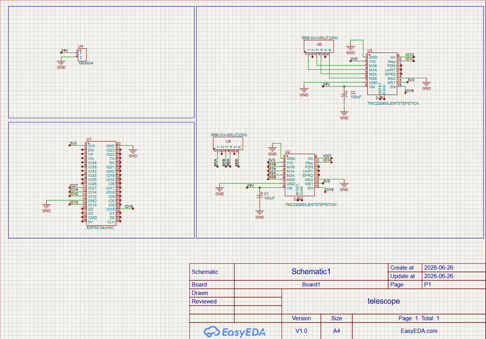
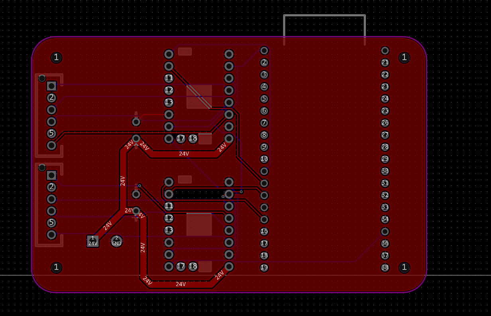
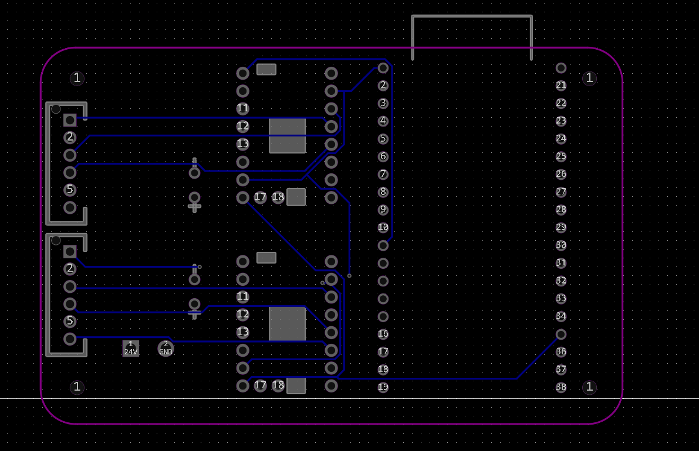
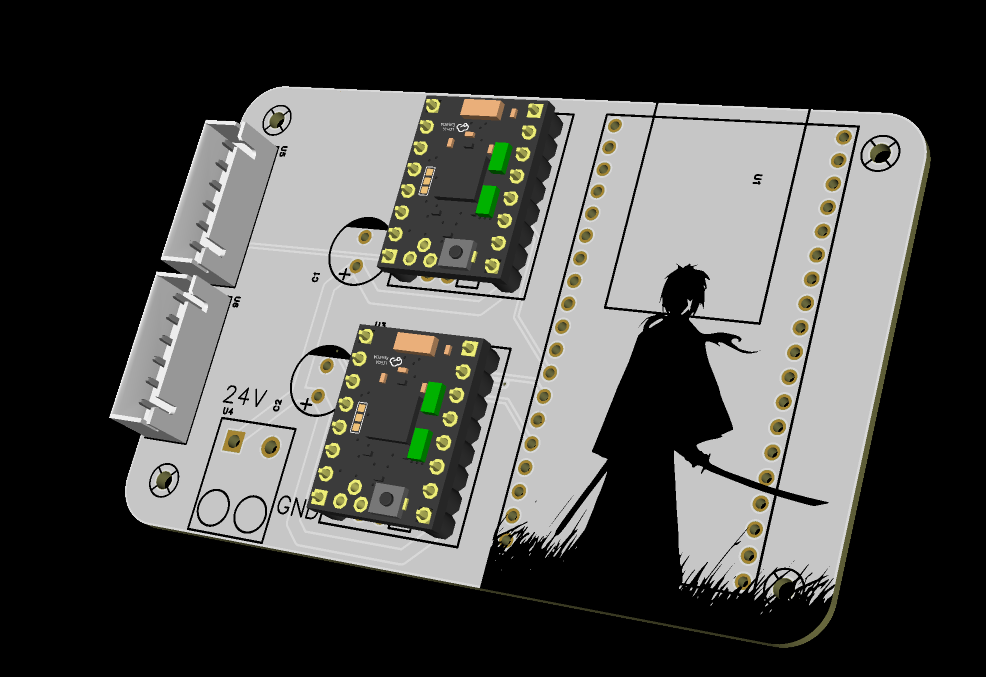
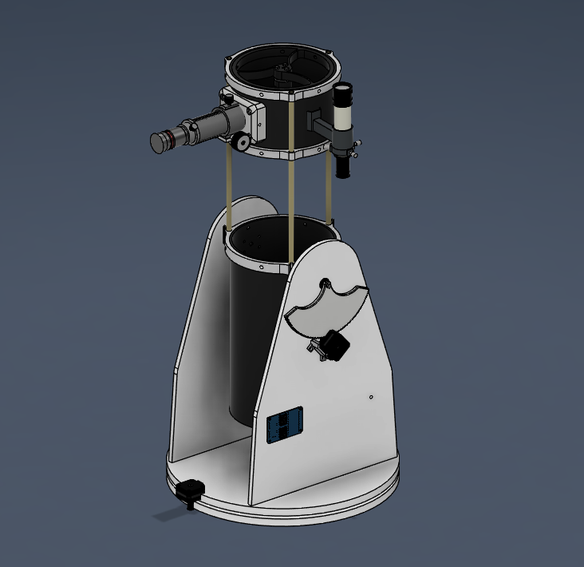
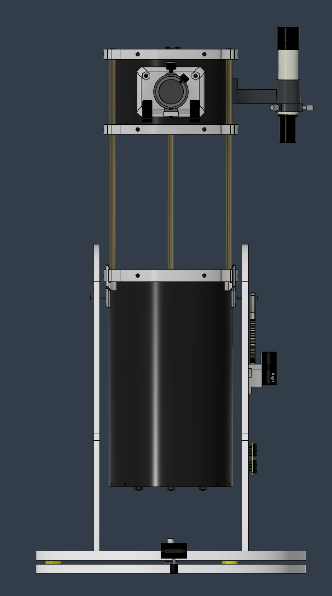
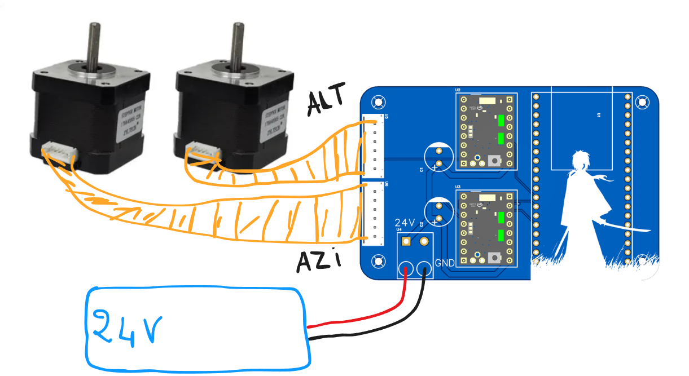
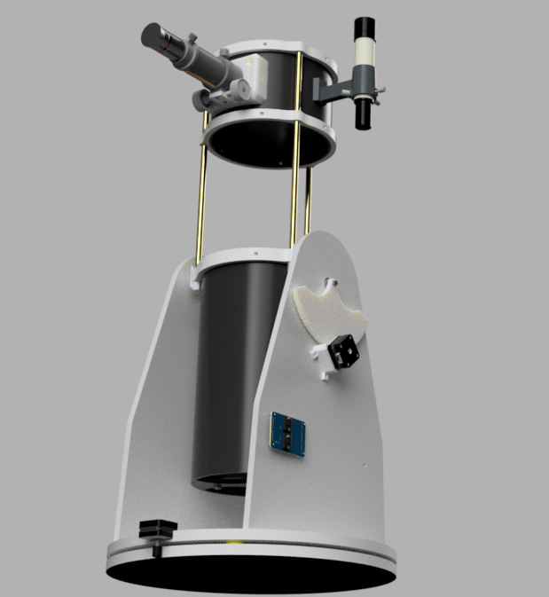
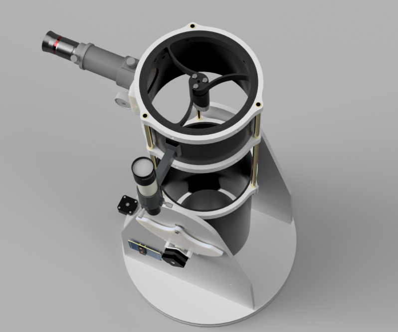

# Rtelescope 

## What this is

Rocky V1 is a motorized, dual axis Alt Azimuth Dobsonian-style telescope mount that automatically finds and tracks deep-sky objects across the night sky. It pairs a high reduction mechanical drivetrain with a custom electronics shield built around hardware interpolated stepper microstepping, so the mount can move in tiny steps instead of big jerky motion you get from driving a stepper motor directly.

## Why I built it

**I built this telescope to see the wonders of the universe**. This is actually my first time ever using one! Since buying a telescope here is extremely expensive, I decided to build my own. I even built it with GoTo tracking, meaning it can track celestial bodies completely on its own without any external help 

## How it works

- **Altitude axis** : controls vertical elevation of the optical tube, counterbalanced for neutral equilibrium from 0° to 90°.
- **Azimuth axis** : controls horizontal rotation on a low-friction bearing track, full 360° pan.
- **Gear reduction** : a high-ratio reduction 
- **Electronics** : an ESP32-DevKitC drives two TMC2209 SilentStepStick modules (one per axis). MS1/MS2 on both drivers are hardware-strapped to lock in native 1/32 stepping, which the TMC2209 internally interpolates up to a smooth 1/256 microstep curve.
- **Power** : single 24V input through a screw terminal block, with 100µF electrolytic caps next to each driver's VM pin to absorb back-EMF spikes during fast GOTO slews.

---

# Electronics 

### Components 

Using cost-effective and available components to build a telescope tracking system :)

* **MCU: ESP32-WROOM-32E**
    * **Specifications:** 32-bit dual-core Xtensa LX6 microprocessor running at 240 MHz, with 520 KB SRAM and 4 MB flash memory.

* **Driver: TMC2209 Stepper Motor Driver**
    * **Specifications:** Ultra silent motor driver for two-phase stepper motors  handles up to 2.8A peak current (2A RMS) per motor supports up to 1/256 microstepping.

* **Power: 24V DC Power Supply**
    * **Specifications:** 24V step-down switching power supply 

### Schematics 

### Routing 

### 3D

---
# Telescope 

For this telescope, I chose a 150mm primary mirror to catch more light, combined with a 30mm secondary and a 6mm eyepiece. This setup provides a really sharp picture of the moon and can easily see the rings of Saturn. It’s also super convenient because the upper assembly can extend and retract with built-in limiters. Plus, it's fully motorized with NEMA 17 motors for 2-axis movement (altitude and azimuth), and it's incredibly smooth since both axes have really high reduction ratios.

---
## How to use it 

### Step 1: Primary and Secondary Optical Assembly
1. **Mount the Primary Mirror:** 
2. **Assemble the Adjustable Rear Cell:** 
3. **Install the Secondary Spider:** 
4. **Mount the Secondary Mirror:** 
5. **Install the Focuser:**

---

### Step 2: Retractable Upper Truss Assembly
1. **Fit the Moving Tubes:** 
2. **Install the Built-in Limiters:** 
3. **Test Mechanical Clearance:**

---

### Step 3: Base Panel Fabrication & Pocket Assembly
1. **Prepare Layered Laser Files:**
2. **Laser Cut the Wood:** 
3. **Stack and Glue the Pocket:** 
---

### Step 4: Alt-Azimuth Mount & Gearing Drivetrain
1. **Build the Azimuth Turntable:** 
2. **Mount the Altitude Axis:** 
3. **Install the NEMA 17 Stepper Motors:** 
4. **Setup the High-Ratio Gear Reductions:** 
---

### Step 5: Custom PCB Electronics Integration
1. **Populate the Motherboard (U1):** 
2. **Install the Driver Modules (U2, U3):** 
3. **Configure Hardware Microstepping Strapping:** 
4. **Connect Control Signals:** 
5. **Wire the Motor Headers:** 
6. **Connect Filtration & Power:** 

---

### Step 6: Power-On Calibration & Tuning
1. **Calibrate Driver Voltage (Vref):** 
2. **Select Tracking Mode Profile:** 
---
### Wire Diagram 

---

# BOM 
revised bill of materials
see the full version in BOM.csv

| Item | Qty | Price (USD) | Info |
| :--- | :---: | :---: | :--- |
| Primary, secondary telescope mirrors | 1 | $60.25 | 150F750 + 30mm |
| Focuser | 1 | $21.37 | Focuser by adjusting the eyepiece |
| Eyepiece | 1 | $56.58 | 6mm |
| Finder scope | 1 | $9.81 | |
| PVC tube | 1 | $9.06 | 200mm diameter |
| Teflon pads | 8 | $7.11 | For removing friction |
| 3D printing shipping | 1 | $40.00 | Shipping from Legion |
| TMC2209 | 2 | $14.24 | Driving the steppers |
| PCB | 5 | $13.04 | From JLCPCB with coupons |
| Tube | 1 | $5.86 | The extruding tube 4m 10mm |
| MDF WOOD for mounts | 1 | $21.31 | Wood to make the mounts |
| Laser cutting fee | 1 | $30.00 | Laser cut the mdf wood |
| ESP32 WROOM32 | 1 | $3.22 | |
| Capacitors | 10 | $6.28 | 100uF electrolytic |
| Stepper motor | 2 | $29.80 | NEMA 17 |
| Screws, nuts | 1 | $20.54 | M6 nuts and screws and M3 |
| Washers | 20 | $3.22 | |
| Black paint aerosol | 1 | $5.22 | To paint the interior of PVC black |
| Silicone adhesive | 1 | $2.93 | Glueing the primary mirrors |
| **TOTAL** | | **$359.84 USD** | |

---

# Pics

---
## License

MIT License, see LICENSE.

 Free to build, modify, and share. Please
credit the project if you publish your own build based on this one.
